# JPA 게시판 프로젝트
가장 기본적인 게시판 프로젝트를 JPA로 구현하기 위한 프로젝트.  
깃허브의 기능을 살려 프로젝트와 마일스톤, 스프린트, 이슈 등을 관리하며 프로젝트 진행

임시 접속: http://hanks.iptime.org:8090/

## 개발 환경
- Intellij IDEA Ultimate 2022.3.3
- Java 17
- Gradle 8.1.1
- Spring Boot 2.7.0

## 기술 세부 스택
Spring Boot

- Spring Web
- Spring Data JPA
- Rest Repositories
- Rest Repositories HAL Explorer
- Thymeleaf
- Spring Security
- H2 Database
- MySQL Driver
- Lombok
- Spring Boot DevTools
- Spring Configuration Processor

그 외
- QueryDSL 5.0.0
- Bootstrap 5.2.0-Beta1

## ERD

## USE CASE

## 화면 캡쳐

### 메인화면

### 상세화면

